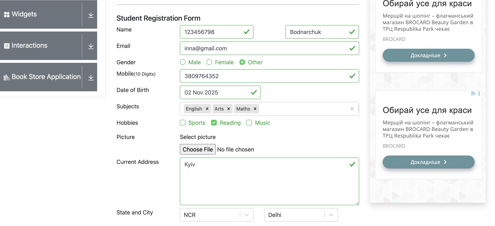

### 🧩 **BugReport_02_NumericValuesInNameField**

**ID:** QA-BUG-002 

**Title:** “First Name” field accepts numeric values on the registration form

**Preconditions:**
User is on the registration page — https://demoqa.com/automation-practice-form.

**Steps to Reproduce:**

**1.** Open the registration page.

**2.** Enter numeric values (12345) in the “First Name” field

**3.** Fill in all other required fields correctly.

**4.** Click the Submit button.

**Expected Result:**

An error message “This field accepts alphabetic characters only.” should be displayed under the "First Name" field.

**Actual Result:**

The system accepts numeric input.

**Severity:** Medium

**Priority:** High

**Environment:**

OS: macOS Sonoma 14.6

Browser: Google Chrome 129.0

App version: Web (latest)

**Attachments:** 

